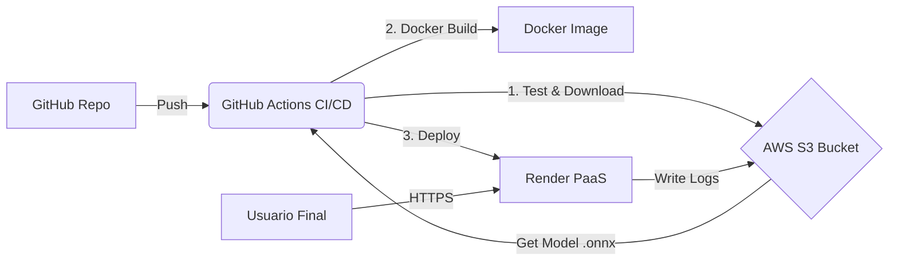

# Sistema de Despliegue Automático MLOps (Iris Classifier)


Este proyecto implementa un pipeline completo de **MLOps** para el despliegue automático de un modelo de Machine Learning (ONNX). La arquitectura está diseñada bajo un enfoque de **Nube Híbrida**, garantizando escalabilidad, auditoría y experiencia de usuario.

---

## Arquitectura de la Solución

El sistema desacopla la lógica de negocio, el almacenamiento de modelos y el cómputo para garantizar flexibilidad.


---

## Características Principales

Modelo Externo Desacoplado: El modelo iris.onnx NO se encuentra en el repositorio. Se descarga dinámicamente desde AWS S3 al iniciar la aplicación. Esto simula un entorno real de ML donde los modelos son pesados y confidenciales.

Logging Persistente y Auditoría: Cada predicción realizada por el usuario genera un log transaccional que se almacena automáticamente en AWS S3 (/logs), garantizando trazabilidad total del sistema.

Interfaz Gráfica Integrada: Se implementó un Frontend (HTML/JS) servido directamente por FastAPI para facilitar la interacción con el usuario final sin requerir conocimientos técnicos.

CI/CD con GitHub Actions:
    Pipeline automatizado que ejecuta:
        Test: Pruebas unitarias (pytest) con descarga de modelo real.
        Build: Construcción de imagen Docker optimizada.
        Deploy: Despliegue continuo a Render (Zero Downtime).

 Stack Tecnológico
    Lenguaje: Python 3.9
    Framework Web: FastAPI
    Motor de Inferencia: ONNX Runtime
    Infraestructura de Datos: AWS S3 (Simple Storage Service)
    Infraestructura de Cómputo: Render (Docker Container Runtime)
    Orquestación: GitHub Actions
    Contenerización: Docker

## Estructura del Proyecto

```text
/
├── .github/workflows/   # Definición del Pipeline CI/CD
├── src/
│   ├── static/          # Frontend (Interfaz Gráfica)
│   ├── app.py           # API Principal y Lógica de Negocio
│   ├── utils.py         # Conectores a AWS S3 (Download/Upload)
│   └── __init__.py
├── tests/               # Pruebas Unitarias
├── Dockerfile           # Receta de construcción del contenedor
├── requirements.txt     # Dependencias del proyecto
└── README.md            # Documentación
```

## Configuración Local

Si deseas correr este proyecto en tu máquina local:

1. Clonar el repositorio:
    git clone [https://github.com/FaridSandoval/proyecto-final-mlops.git](https://github.com/FaridSandoval/proyecto-final-mlops.git)
    cd proyecto-final-mlops

2. Instalar dependencias:
    pip install -r requirements.txt

3. Configurar Variables de Entorno: Necesitas credenciales de AWS con permisos de lectura/escritura en S3.
    # En Linux/Mac
    export AWS_ACCESS_KEY_ID="TU_KEY"
    export AWS_SECRET_ACCESS_KEY="TU_SECRET"
    export S3_BUCKET_NAME="NOMBRE_DEL_BUCKET"

    # En Windows (PowerShell)
    $env:AWS_ACCESS_KEY_ID="TU_KEY"
    $env:AWS_SECRET_ACCESS_KEY="TU_SECRET"
    $env:S3_BUCKET_NAME="NOMBRE_DEL_BUCKET"

4. Ejecutar la aplicación:
    uvicorn src.app:app --reload
    Visita http://localhost:8000 para ver la interfaz.

## Endpoints de la API
| Método | Endpoint | Descripción |
| :--- | :--- | :--- |
| `GET` | `/` | Carga la Interfaz Gráfica de Usuario (Web). |
| `POST` | `/predict` | Recibe JSON con medidas de la flor y devuelve la clase predicha. |
| `GET` | `/docs` | Documentación técnica automática (Swagger UI). |

## Autores
Proyecto realizado para la asignatura de Despliegue de Soluciones Analíticas.

Diana Varela
Farid Sandoval